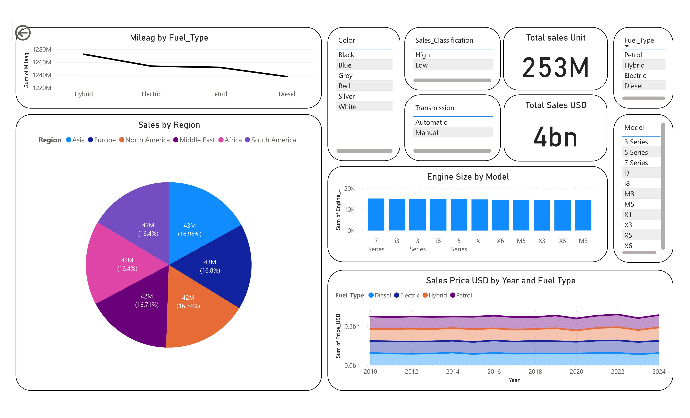

# 🚗 BMW Sales Analytics Dashboard (Power BI)

### 📊 Overview
This project presents an interactive **BMW Sales Dashboard** built in **Power BI**, designed to analyze global sales performance, revenue trends, and product insights.  
The dashboard provides a comprehensive view of **sales, mileage, engine sizes, and price trends** across multiple regions, models, and fuel types.

---

### 📈 Key Insights
- **Total Sales:** 253M units  
- **Total Revenue:** USD 4 Billion  
- **Fuel Type Performance:**  
  - Highest mileage in **Hybrid vehicles**  
  - Gradual decline through **Electric, Petrol, and Diesel**  
- **Regional Sales Distribution:**  
  - Nearly equal contribution from all six regions — *Asia, Europe, North America, Middle East, Africa, and South America*  
- **Sales Trends (2010–2024):**  
  - Stable growth in total sales value  
  - Increasing sales of **Electric and Hybrid** vehicles  
- **Top Models:** BMW 3 Series, 5 Series, 7 Series, i3, i8, M3, M5, X1–X6  
- **Engine Size:** Consistent engine capacity across popular models  

---

### 📂 Dashboard Components
| Section | Description |
|----------|--------------|
| **Mileage by Fuel Type** | Line chart comparing mileage performance across fuel types |
| **Sales by Region** | Pie chart showing regional market share |
| **Engine Size by Model** | Bar chart comparing engine sizes among BMW models |
| **Sales Price by Year & Fuel Type** | Area chart showing price trend from 2010–2024 |
| **KPIs** | Total sales units and total sales in USD |
| **Filters** | Dynamic filters for color, transmission, model, and sales classification |

---

### 🧰 Tools & Technologies
- **Power BI Desktop**
- **Microsoft Excel / CSV (data source)**
- **DAX & Power Query**
- **Data Visualization & Dashboard Design**

---

### 🎯 Purpose
This dashboard helps BMW’s management and analysts:
- Monitor **global performance metrics**
- Identify **top-performing regions and models**
- Understand **market shift toward electric and hybrid vehicles**
- Track **revenue and mileage trends** over time

---

### 🖼️ Dashboard Preview

---

### 💡 Future Enhancements
- Integration with **real-time sales API**
- Addition of **profitability and maintenance cost analysis**
- Predictive analytics using **Power BI AI visuals**
